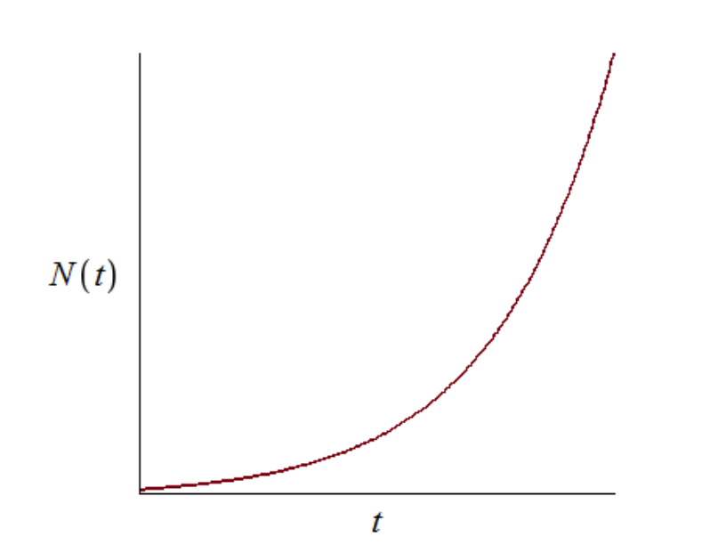
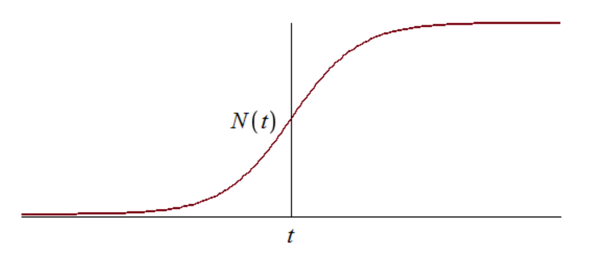
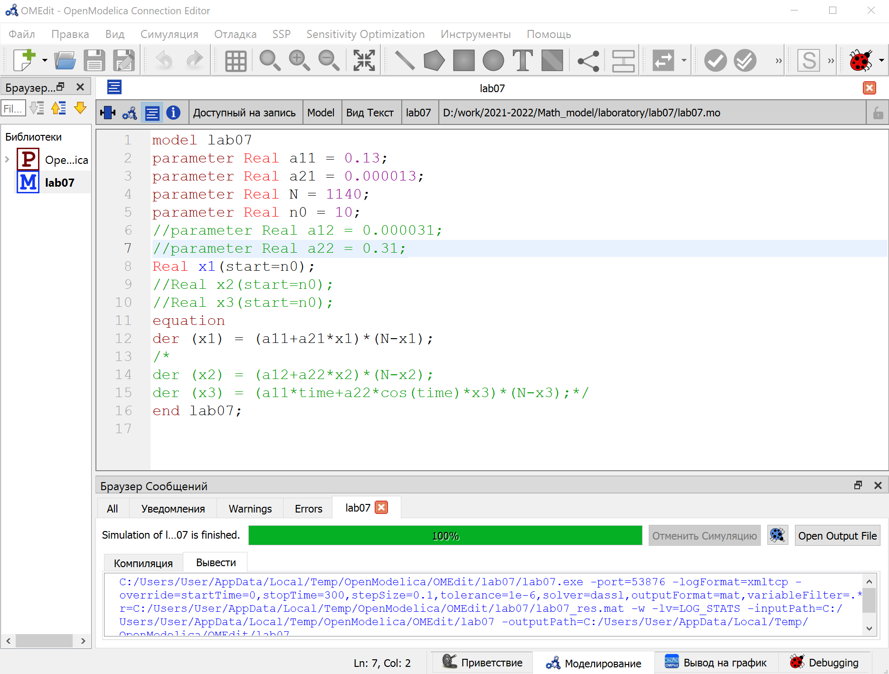
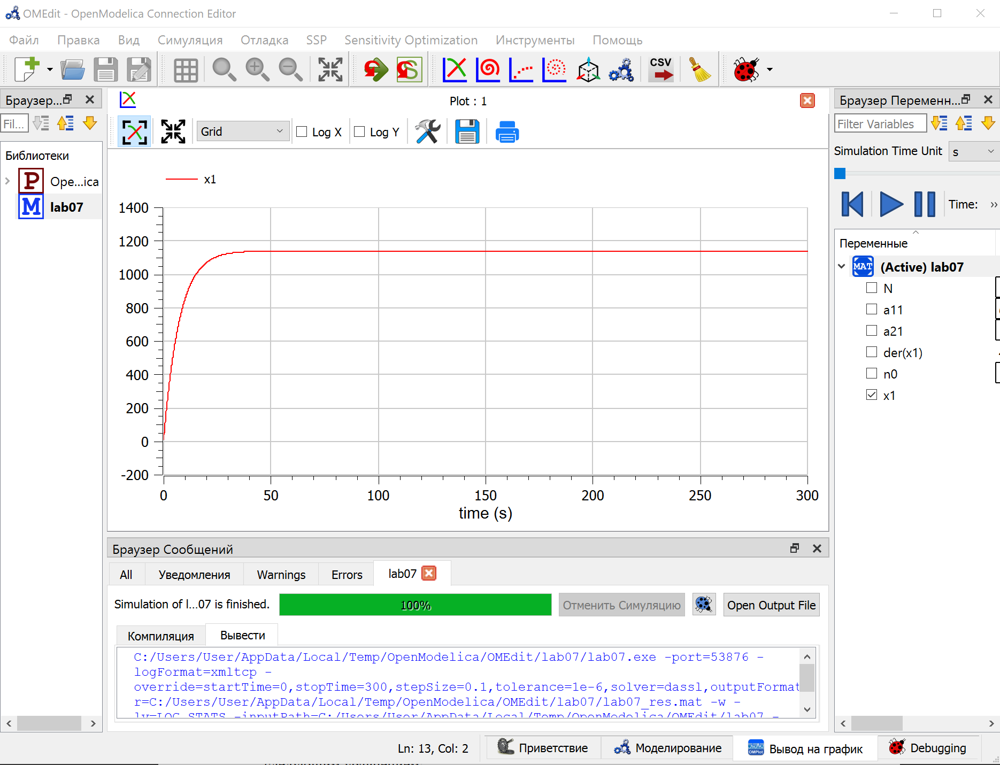
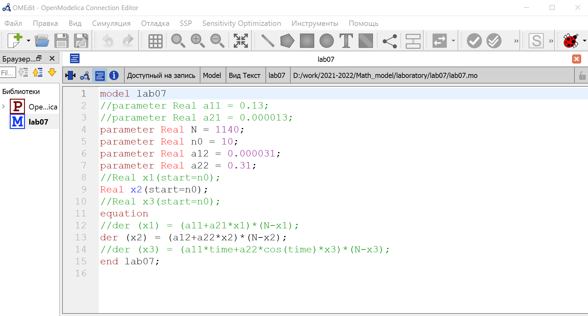
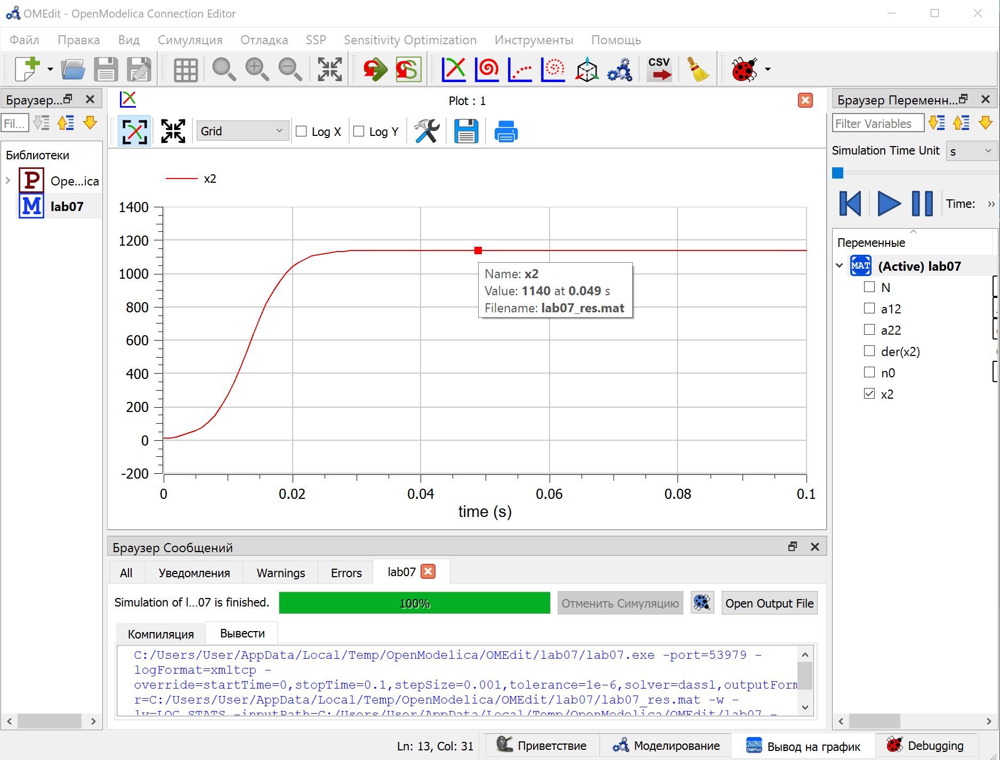
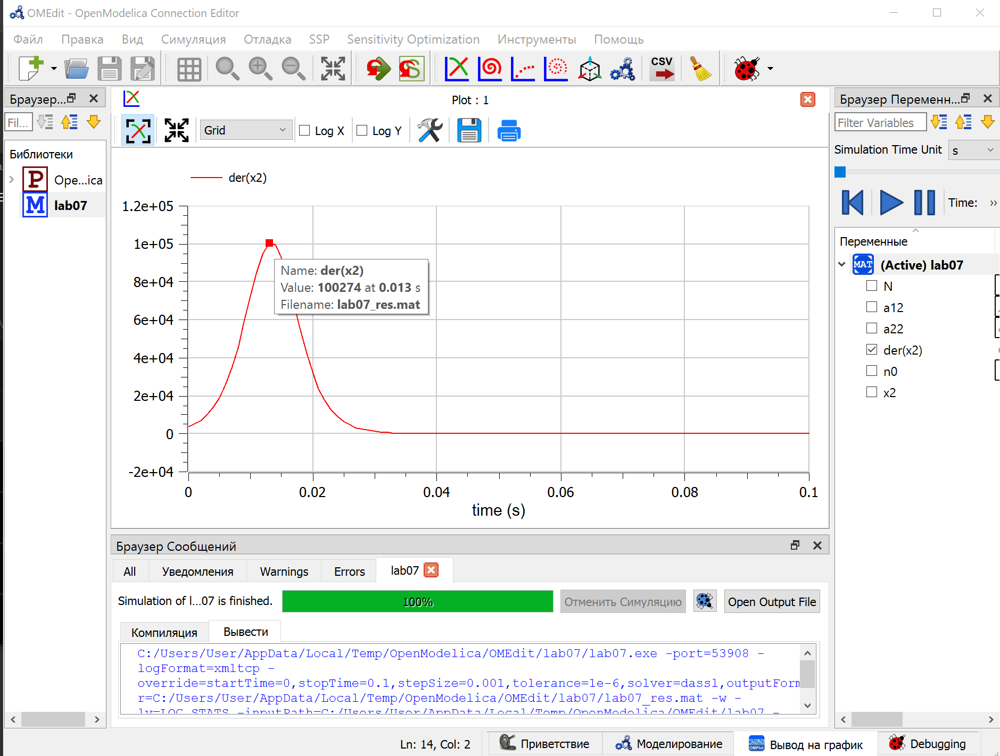
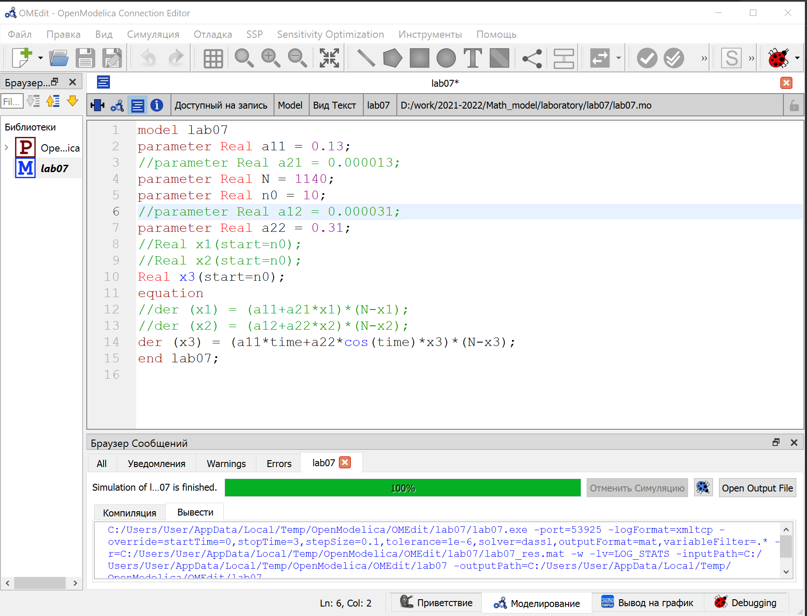
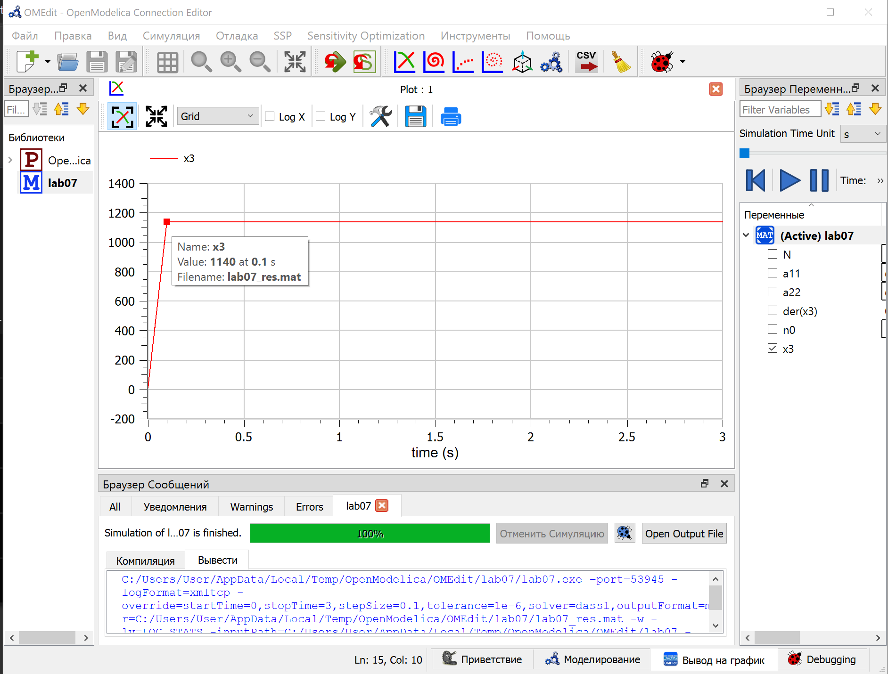

# Цель работы

Постройте график распространения рекламы, математическая модель которой описывается следующим уравнением:

1. $$\frac{dn}{dt}=(a1+a2*n(t))(N-n(t)), a1>a2$$
2. $$\frac{dn}{dt}=(a1+a2*n(t))(N-n(t)), a2>a1$$
3. $$\frac{dn}{dt}=(a1*t+a2*\cos(t)*n(t))(N-n(t))$$

# Задание работы

### Вариант 37

1. $$\frac{dn}{dt}=(0.13+0.000013*n(t))(N-n(t))$$
2. $$\frac{dn}{dt}=(0.000031+0.31*n(t))(N-n(t))$$
3. $$\frac{dn}{dt}=(0.13*t+0.31*\cos(t)*n(t))(N-n(t))$$

При этом объем аудитории N=1140, в начальный момент о товаре знает 10 человек. Для случая 2 определите в какой момент времени скорость распространения рекламы будет иметь максимальное значение.

# Теоретическое введение

## Постановка задачи

Организуется рекламная кампания нового товара или услуги. Необходимо, чтобы прибыль будущих продаж с избытком покрывала издержки на рекламу. Вначале расходы могут превышать прибыль, поскольку лишь малая часть потенциальных покупателей будет информирована о новинке. Затем, при увеличении числа продаж, возрастает и прибыль, и, наконец, наступит момент, когда рынок насытиться, и рекламировать товар станет бесполезным.
Предположим, что торговыми учреждениями реализуется некоторая продукция, о которой в момент времени t из числа потенциальных покупателей N знает лишь n покупателей. Для ускорения сбыта продукции запускается реклама по радио, телевидению и других средств массовой информации. После запуска рекламной кампании информация о продукции начнет распространяться среди потенциальных покупателей путем общения друг с другом. Таким образом, после запуска рекламных объявлений скорость изменения числа знающих о продукции людей пропорциональна как числу знающих о товаре покупателей, так и числу покупателей о нем не знающих.

Модель рекламной кампании описывается следующими величинами. Считаем, что $\frac{dn}{dt}$ - скорость изменения со временем числа потребителей, узнавших о товаре и готовых его купить, t - время, прошедшее с начала рекламной кампании, n(t) - число уже информированных клиентов. Эта величина пропорциональна числу покупателей, еще не знающих о нем, это описывается следующим образом: $a_1$(t)(N-n(t)), где N - общее число потенциальных платежеспособных покупателей, $a_1$(t)>0 - характеризует интенсивность рекламной кампании (зависит от затрат на рекламу в данный момент времени). Помимо этого, узнавшие о товаре потребители также распространяют полученную информацию среди потенциальных покупателей, не знающих о нем (в этом случае работает т.н. сарафанное радио). Этот вклад в рекламу описывается величиной $a_2$(t)(N-n(t)), эта величина увеличивается с увеличением потребителей узнавших о товаре. Математическая модель распространения рекламы описывается уравнением:

$$\frac{dn}{dt}=(a_{1}(t)+a_{2}(t)n(t)(N-n(t))$$

При $a_1$(t)>>$a_2$(t) получается модель типа модели Мальтуса, решение которой имеет вид(@fig:001):

{#fig:001 width=100%}

В обратном случае, при $a_1$(t)<<$a_2$(t) получаем уравнение логистической кривой(@fig:002):

{#fig:002 width=100%}

# Выполнение лабораторной работы

## Код в OpenModelica

Задаем параметры и прописываем функцию, записываем дифференциальные уравнения.(@fig:003) a_1>a_2

{#fig:003 width=100%}

Получаем график. (@fig:004)

{#fig:004 width=100%}

Меняем параметры(@fig:005). a_2>a_1

{#fig:005 width=100%}

Получаем график. (@fig:006)

{#fig:006 width=100%}

Видим, что сарафанное радио работает лучше, чем рекламная кампания(примерно 40 секунд против 0.05). Причем скорость распространения рекламы будет иметь максимальное значение на 0.013 (@fig:007).

{#fig:007 width=100%}

Меняем параметры(@fig:008).

{#fig:008 width=100%}

Получаем график. (@fig:009)

{#fig:009 width=100%}

# Вывод

Построили график распространения рекламы, математическая модель которой описывается следующим уравнением:

1. $$\frac{dn}{dt}=(a_1+a_2*n(t))(N-n(t)), a_1>a_2$$
2. $$\frac{dn}{dt}=(a_1+a_2*n(t))(N-n(t)), a_2>a_1$$
3. $$\frac{dn}{dt}=(a_1*t+a_2*\cos(t)*n(t))(N-n(t))$$

Для второго случая нашли момент, когда скорость распространения рекламы максимальна.

# Список литературы

1. Теоретические материалы курса.
